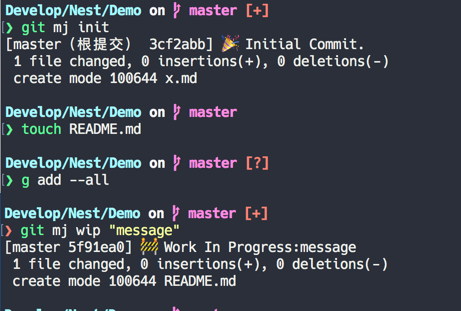

# git-emoji

给 commit message 添加 emoji 前缀

主要参考了 [gitmoji](https://gitmoji.carloscuesta.me/)




## Install

```shell
wget --no-check-certificate -q -O - https://raw.githubusercontent.com/octree/git-emoji/master/installer/gitmj-installer.sh | bash
```

```shell
curl -fsSL https://raw.githubusercontent.com/octree/git-emoji/master/installer/gitmj-installer.sh | bash
```

